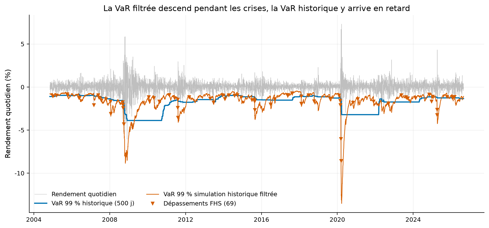
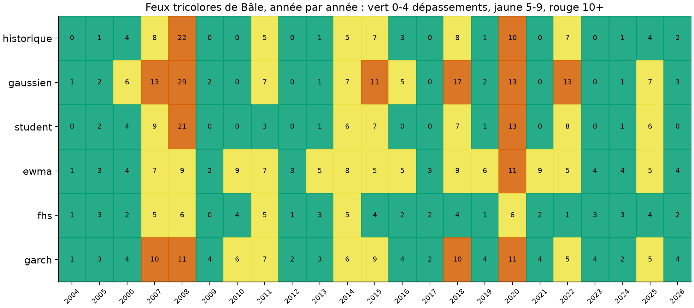
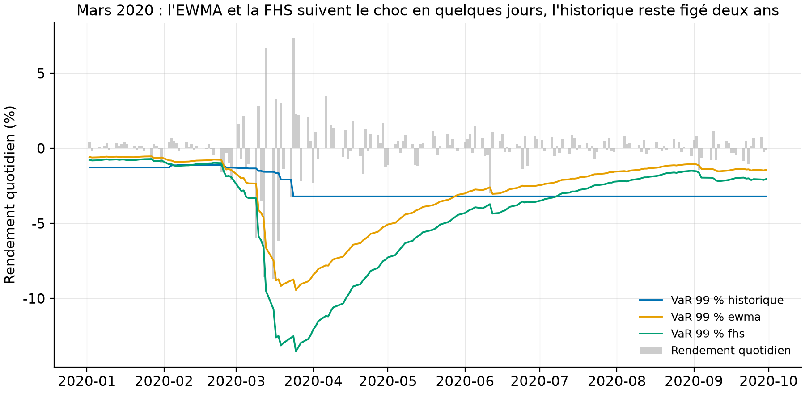

# Un moteur de risque canadien : six modèles de VaR jugés par les backtests réglementaires

Ce dépôt mesure le risque du portefeuille équilibré canadien du dépôt
[03-portfolio-ops-ca](https://github.com/Guilou001/03-portfolio-ops-ca) avec six modèles de VaR et
d'Expected Shortfall, puis les fait juger par les quatre backtests que les régulateurs utilisent :
Kupiec, Christoffersen, les feux tricolores de Bâle année par année, et Acerbi-Székely pour l'ES.

[](https://github.com/Guilou001/06-risque-marche/actions/workflows/ci.yml)


**Résultat en une phrase.** Sur 5 476 jours ouvrés hors échantillon (novembre 2004 à août 2026), la
**simulation historique filtrée est le seul des six modèles qui passe le test de Kupiec** (69
dépassements pour 54,8 attendus à 99 %, p = 0,063) et le seul sans aucune année en zone rouge de
Bâle ; les modèles à queue normale dépassent 121 à 140 fois, et la VaR historique dépasse en grappes,
avec 22 dépassements dans la seule année 2008.

*English summary.* A risk engine for the balanced Canadian ETF portfolio of repo 03: six one-day VaR
and Expected Shortfall models (historical, Gaussian, Student-t, RiskMetrics EWMA, filtered historical
simulation, and a GARCH(1,1) fitted by maximum likelihood written from scratch), backtested over
5,476 out-of-sample days with Kupiec, Christoffersen, year-by-year Basel traffic lights and
Acerbi-Székely. Filtered historical simulation is the only model that passes Kupiec coverage
(69 violations vs 54.8 expected, p = 0.063) and the only one with zero red Basel years; normal-tail
models violate 121 to 140 times, and plain historical VaR violates in clusters (22 times in 2008).

## 1. La question posée

Une banque annonce chaque matin sa VaR à 99 %, la perte quotidienne qu'elle ne devrait dépasser
qu'un jour sur cent. En mots simples : « demain, sauf malchance rare, je ne perdrai pas plus que ce
chiffre ». Le régulateur ne juge pas la formule, il compte les dépassements : si la perte réelle
excède la VaR annoncée beaucoup plus d'un jour sur cent, ou plusieurs jours de suite, le modèle est
faux et le capital exigé monte. La question du dépôt : parmi six façons classiques de calculer cette
VaR, lesquelles survivent à vingt-deux ans de données canadiennes réelles, crises de 2008, 2020 et
2022 comprises ?

## 2. D'où vient le projet, et ce qu'il apporte

La boîte à outils vient de quatre papiers et d'un standard d'industrie : RiskMetrics (J.P. Morgan,
1996) pour la volatilité EWMA, Bollerslev (1986) pour le GARCH, Barone-Adesi, Giannopoulos et Vosper
(1999) pour la simulation historique filtrée, Kupiec (1995) et Christoffersen (1998) pour les tests,
et le cadre de Bâle (feux tricolores de 1996, puis la FRTB qui impose l'Expected Shortfall à
97,5 %). Ce que ce dépôt apporte :

- **Le juge avant le modèle.** Les six modèles sont soumis aux mêmes 5 476 jours et aux mêmes
  quatre tests ; aucun chiffre de qualité de modèle n'est affirmé sans son backtest.
- **Un GARCH(1,1) écrit et vérifié ici même**, vraisemblance maximisée sans bibliothèque
  spécialisée, avec un test qui retrouve les paramètres d'une série simulée connue.
- **Aucun regard sur le futur, testé** : la prévision du jour t n'utilise que les jours antérieurs,
  et un test choque le dernier jour pour vérifier qu'aucune prévision passée ne bouge.
- **La lecture réglementaire** : la carte des feux de Bâle année par année, le format que les
  comités de risque regardent réellement.

## 3. Les données : le portefeuille du dépôt 03, vu au jour le jour

Le portefeuille suivi est le profil équilibré du moteur d'allocation : six FNB de Toronto aux poids
25 % actions canadiennes, 20 % actions américaines, 15 % actions internationales, 5 % immobilier
coté, 25 % obligations univers, 10 % obligations court terme. Son rendement QUOTIDIEN, l'échelle de
temps de la VaR réglementaire, est calculé aux poids cibles tenus constants ; l'approximation est
déclarée et de second ordre, le dépôt 03 mesure une rotation réelle de 2,8 % par an. Prix ajustés
Yahoo Finance téléchargés par `rke fetch`, jamais commités (usage personnel) ; 5 977 rendements
quotidiens d'octobre 2002 à août 2026, mesuré.

## 4. La méthode, pas à pas

Chaque modèle refait chaque jour le même geste : estimer sur les 500 jours ouvrés précédents (deux
ans), annoncer la VaR et l'ES du lendemain, puis passer au jour suivant. La VaR au niveau alpha est
moins le quantile alpha des rendements, rapportée en positif ; l'Expected Shortfall, la perte
moyenne des jours où la VaR est dépassée, en positif aussi. Les six modèles :

1. **Historique** : le quantile empirique des 500 derniers jours, tel quel.
2. **Gaussien** : moyenne et écart-type de la fenêtre, quantile de la loi normale.
3. **Student-t** : une loi de Student, dont les queues épaisses donnent plus de poids aux jours
   extrêmes, ajustée par maximum de vraisemblance et réajustée tous les 21 jours.
4. **EWMA** : la volatilité RiskMetrics, une moyenne des carrés de rendements qui oublie
   exponentiellement le passé (lambda = 0,94), avec un quantile normal.
5. **Simulation historique filtrée (FHS)** : chaque rendement passé est divisé par la volatilité
   EWMA de son jour, puis remis à l'échelle de la volatilité prévue pour demain ; le quantile est
   pris sur ces rendements re-scalés. La queue reste empirique, le niveau suit la volatilité.
6. **GARCH(1,1)** : la variance de demain est une combinaison estimée de la variance d'aujourd'hui
   et du choc d'aujourd'hui, réestimée tous les 21 jours par maximum de vraisemblance, innovations
   normales.

Les quatre juges, appliqués aux mêmes jours pour tous les modèles : le test de Kupiec compare le
NOMBRE de dépassements à l'attendu ; le test de Christoffersen vérifie qu'ils n'arrivent pas en
grappes (un dépassement hier ne doit rien dire sur demain) ; les feux de Bâle comptent par année
civile (vert 0 à 4, jaune 5 à 9, rouge 10 et plus) ; la statistique Z2 d'Acerbi-Székely (2014) vaut
zéro si l'ES annoncé égale la perte moyenne des jours de dépassement, elle est négative s'il la
sous-estime.

## 5. Les résultats : la queue empirique et la volatilité dynamique, il faut les deux (mesuré)

Tous les chiffres viennent de `results/tables/backtests_var99.csv` et `backtests_es975.csv`,
régénérés par `uv run rke backtest` ; 5 476 jours communs, novembre 2004 à août 2026, VaR à 99 %.

| Modèle | Dépassements (54,8 attendus) | Taux | p Kupiec | p indépendance | VaR moyenne |
|---|---:|---:|---:|---:|---:|
| **FHS** | **69** | **1,26 %** | **0,063** | 0,012 | 1,62 % |
| Historique | 89 | 1,63 % | 0,000 | 0,000 | 1,74 % |
| Student-t | 89 | 1,63 % | 0,000 | 0,000 | 1,78 % |
| GARCH(1,1) normal | 121 | 2,21 % | 0,000 | 0,192 | 1,29 % |
| EWMA | 128 | 2,34 % | 0,000 | 0,277 | 1,30 % |
| Gaussien | 140 | 2,56 % | 0,000 | 0,000 | 1,42 % |

Comment lire ce tableau, en trois constats. D'abord, les deux familles échouent pour des raisons
opposées : les modèles à volatilité dynamique et queue normale (EWMA, GARCH) réagissent vite, donc
leurs dépassements sont indépendants (p = 0,19 à 0,28), mais la queue normale en produit deux fois
trop ; les modèles à queue riche mais niveau figé (historique, Student) ont le bon ordre de grandeur
de dépassements mais les font en grappes (p d'indépendance nulle), le pire moment possible. Ensuite,
la FHS, qui combine queue empirique et volatilité EWMA, est la seule à passer Kupiec ; son p
d'indépendance de 0,012 reste sous 5 %, aucun modèle n'est parfait et c'est écrit. Enfin, le prix
de la prudence se lit dans la dernière colonne : l'historique immobilise une VaR moyenne de 1,74 %
pour échouer quand même, la FHS fait mieux avec 1,62 %.



Comment lire cette figure : le trait gris est le rendement quotidien du portefeuille, les deux
courbes sont moins la VaR 99 % annoncée la veille (historique en bleu, FHS en vermillon), et chaque
triangle un jour où la perte a traversé la VaR de la FHS. La courbe historique forme des marches :
elle descend après les crises et reste basse environ deux ans, le temps que la fenêtre de 500 jours
oublie ; la courbe FHS descend pendant la crise et remonte quelques semaines après.



Comment lire cette figure : une ligne par modèle, une colonne par année, le chiffre est le nombre de
dépassements de la VaR 99 % et la couleur la zone de Bâle. La ligne FHS est la seule sans case
rouge (18 années vertes, 5 jaunes) ; l'historique est rouge en 2008 (22 dépassements) et 2020 (10) ;
le gaussien cumule six années rouges. C'est le tableau qu'un comité de risque regarde, et il suffit
à classer les modèles.



Comment lire cette figure : les barres grises sont les rendements quotidiens de janvier à septembre
2020, les courbes moins la VaR 99 % de trois modèles. L'historique (bleu) met deux semaines à
réagir puis reste figé à 3,2 % jusqu'en mars 2022 ; l'EWMA et la FHS plongent avec le choc (la FHS
jusqu'à 13,5 %) puis reviennent en quelques mois. La VaR historique est en retard dans les deux
sens : trop basse pendant la crise, trop haute longtemps après.

Sur l'Expected Shortfall à 97,5 %, le niveau de la FRTB (`backtests_es975.csv`) : la FHS reste
première (158 dépassements pour 136,9 attendus, p = 0,075) et le gaussien dernier, le Student
reculant derrière le GARCH ; la FHS affiche le Z2 le plus proche de zéro (−0,16) et un ratio perte
réalisée sur ES annoncé de 0,97 les jours de dépassement, contre 1,36 pour le gaussien, qui
sous-estime donc ses pertes de queue d'un bon tiers.

## 6. Reproduire

```bash
uv sync --locked --all-extras     # environnement verrouillé (Python 3.12, scipy, sans bibliothèque GARCH)
uv run pytest                     # 10 tests synthétiques, sans réseau (quantiles, fuite, GARCH, juges)
uv run rke fetch                  # prix quotidiens des six FNB (quelques secondes, non commités)
uv run rke backtest               # 6 modèles x 5 476 jours x 2 niveaux : tables + 3 figures (12 s mesurées)
```

## 7. Limites, avec leur statut

| Limite | Statut |
|---|---|
| Le GARCH utilise des innovations normales ; un GARCH-t ou un GARCH-FHS ferait mieux en queue | reconnu ; la FHS joue déjà ce rôle avec la volatilité EWMA |
| La statistique Z2 est rapportée sans p-valeur simulée (Acerbi-Székely la calculent par simulation du modèle) ; le seuil indicatif de −0,7 est un précepte, pas une mesure | déclaré |
| Poids du portefeuille tenus constants aux cibles (la rotation réelle mesurée au dépôt 03 est de 2,8 % par an) | approximation déclarée |
| Un seul portefeuille testé ; les conclusions valent pour un profil équilibré, pas pour un livre de dérivés | reconnu |
| Fenêtre unique de 500 jours et réajustement tous les 21 jours, non optimisés | choix déclarés |
| Classeur Excel/VBA de restitution pour comité de risque | à venir |

## 8. Crédits, licence, citation

Kupiec, P. (1995), « Techniques for Verifying the Accuracy of Risk Measurement Models » ;
Christoffersen, P. (1998), « Evaluating Interval Forecasts » ; Barone-Adesi, G., Giannopoulos, K. et
Vosper, L. (1999), « VaR without Correlations for Portfolios of Derivative Securities » ;
Bollerslev, T. (1986) ; Acerbi, C. et Székely, B. (2014), « Backtesting Expected Shortfall » ;
J.P. Morgan (1996), RiskMetrics Technical Document ; Comité de Bâle (1996, 2019). Données : Yahoo
Finance, usage personnel, non redistribuées. Code : Guillaume Vaudescal, 2026, licence MIT.
